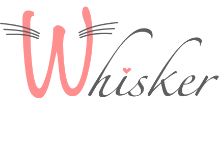

<!-- PROJECT SHIELDS -->
<!--
*** I'm using markdown "reference style" links for readability.
*** Reference links are enclosed in brackets [ ] instead of parentheses ( ).
*** See the bottom of this document for the declaration of the reference variables
*** for contributors-url, forks-url, etc. This is an optional, concise syntax you may use.
*** https://www.markdownguide.org/basic-syntax/#reference-style-links
-->
[![Contributors][contributors-shield]][contributors-url]
[![Stargazers][stars-shield]][stars-url]
[![Issues][issues-shield]][issues-url]
[![LinkedIn][linkedin-shield]][linkedin-url]


<!-- PROJECT LOGO -->
<br />
<p align="center">
  

  <h3 align="center">Whisker - The dating site for cats</h3>

  <p align="center">
    A fun application built to showcase my fullstack capabilities!
    <br />
    <a href="https://whisker.live">View Demo</a>
    ·
    <a href="https://github.com/StevenMcHenry01/whisker">Report Bug</a>
    ·
    <a href="https://github.com/StevenMcHenry01/whisker">Request Feature</a>
  </p>
</p>


<!-- TABLE OF CONTENTS -->
<details open="open">
  <summary>Table of Contents</summary>
  <ol>
    <li>
      <a href="#about-the-project">About The Project</a>
      <ul>
        <li><a href="#built-with">Built With</a></li>
      </ul>
    </li>
    <li>
      <a href="#getting-started">Getting Started</a>
      <ul>
        <li><a href="#prerequisites">Prerequisites</a></li>
        <li><a href="#installation">Installation</a></li>
      </ul>
    </li>
    <li><a href="#usage">Usage</a></li>
    <li><a href="#roadmap">Roadmap</a></li>
    <li><a href="#contributing">Contributing</a></li>
    <li><a href="#license">License</a></li>
    <li><a href="#contact">Contact</a></li>
    <li><a href="#acknowledgements">Acknowledgements</a></li>
  </ol>
</details>

<!-- ABOUT THE PROJECT -->
## About The Project

![Whisker Screen Shot][product-screenshot1]

I set out on creating this project because I wanted to build something silly, but at the same time showcased my abilities as a developer. I had no dreams of many users actually using this service... I mean, who needs to find love for their cat? I had an awesome time learning new technologies and pushing my development capabilities further than I have before!

I also wanted to challenge myself by not using any CSS frameworks. Every aspect of this application has been developed from scratch using sass.

![Whisker Screen Shot][product-screenshot2]

### Built With

* [Typescript](https://www.typescriptlang.org/)
* [React](https://reactjs.org/)
* [Apollo-Client](https://www.apollographql.com/docs/react/)
* [Apollo-Server](https://www.apollographql.com/docs/apollo-server/)
* [Mailgun](https://www.mailgun.com/)
* [Cloudinary](https://cloudinary.com/)
* [react-spring](https://www.react-spring.io/)
* [NextJs](https://nextjs.org/)
* [GraphQl](https://graphql.org/)
* [TypeORM](https://typeorm.io/#/)
* [Type-graphql](https://typegraphql.com/)
* [Docker](https://www.docker.com/)
* [Dokku](http://dokku.viewdocs.io/dokku/)


<!-- GETTING STARTED -->
## Getting Started

To get a local copy up and running follow these simple example steps.

### Prerequisites

* You will have to make accounts with both cloudinary and mailgun

### Installation

1. Clone the repo
   ```sh
   git clone https://github.com/StevenMcHenry01/whisker.git
   ```
2. cd into both server and client and install packages
   ```sh
   yarn i
   ```
3. For frontend, enter all .env information in a .env.local file using the .env.example as a template
   ```
   API_KEY=ENTER YOUR API
   ```
4. For backend, enter all .env information in a .env.development file using the .env.example as a template
   ```
   API_KEY=ENTER YOUR API
   ```
5. in server folder you will want to run
   ```
   yarn watch
   ```
   along with
   ```
   yarn dev
   ```
   in open tabs
6. in client folder you will run
   ```
   yarn dev
   ```


<!-- USAGE EXAMPLES -->
## Usage

A simple use case for this application would be for a user to sign up using their email address. Then the could create a profile for a cat of theirs. After their newly created cat was selected, they could then go to the homescreen and begin liking or disliking cats. If they like a cat that likes them back they can message them!


<!-- ROADMAP -->
## Roadmap

See the [open issues](https://github.com/StevenMcHenry01/whisker/issues) for a list of proposed features (and known issues).


<!-- CONTRIBUTING -->
## Contributing

Contributions are what make the open source community such an amazing place to be learn, inspire, and create. Any contributions you make are **greatly appreciated**.

1. Fork the Project
2. Create your Feature Branch (`git checkout -b feature/AmazingFeature`)
3. Commit your Changes (`git commit -m 'Add some AmazingFeature'`)
4. Push to the Branch (`git push origin feature/AmazingFeature`)
5. Open a Pull Request


<!-- LICENSE -->
## License

Distributed under the MIT License. See `LICENSE` for more information.


<!-- CONTACT -->
## Contact

Steven McHenry - [@stevenmchenry01](https://twitter.com/StevenMcHenry01) - [stevenmchenry.dev](https://stevenmchenry.dev) - stevenmchenry01@gmail.com

Project Link: [https://github.com/StevenMcHenry01/whisker](https://github.com/StevenMcHenry01/whisker)


<!-- MARKDOWN LINKS & IMAGES -->
<!-- https://www.markdownguide.org/basic-syntax/#reference-style-links -->
[contributors-shield]: https://img.shields.io/github/contributors/stevenmchenry01/whisker.svg?style=for-the-badge
[contributors-url]: https://github.com/stevenmchenry01/whisker/graphs/contributors
[stars-shield]: https://img.shields.io/github/stars/stevenmchenry01/whisker.svg?style=for-the-badge
[stars-url]: https://github.com/stevenmchenry01/whisker/stargazers
[issues-shield]: https://img.shields.io/github/issues/stevenmchenry01/whisker.svg?style=for-the-badge
[issues-url]: https://github.com/stevenmchenry01/whisker/issues
[linkedin-shield]: https://img.shields.io/badge/-LinkedIn-black.svg?style=for-the-badge&logo=linkedin&colorB=555
[linkedin-url]: https://linkedin.com/in/stevenmchenry01/
[product-screenshot1]: images/landing_wide.png
[product-screenshot2]: images/chat.png